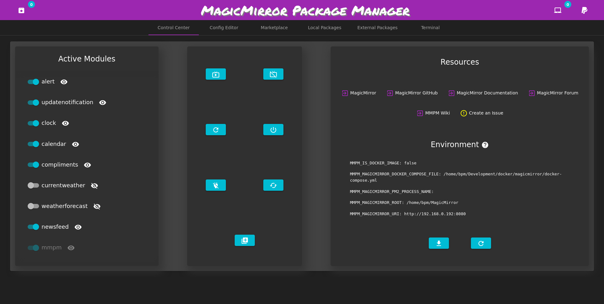
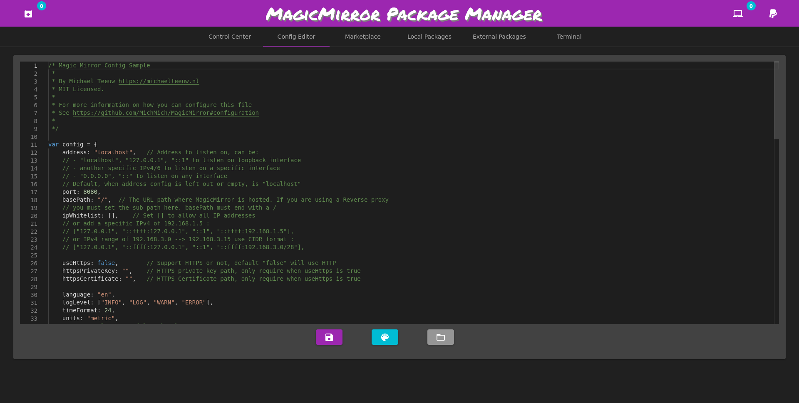
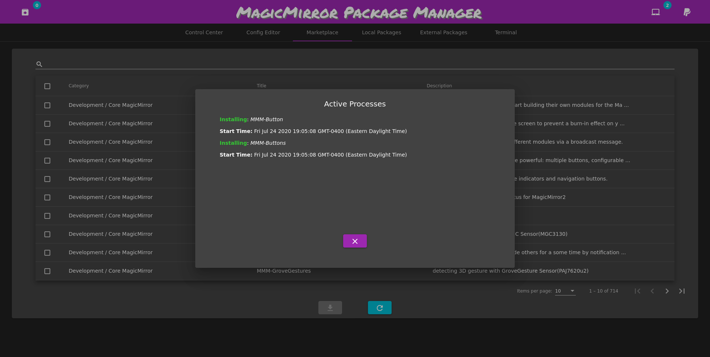
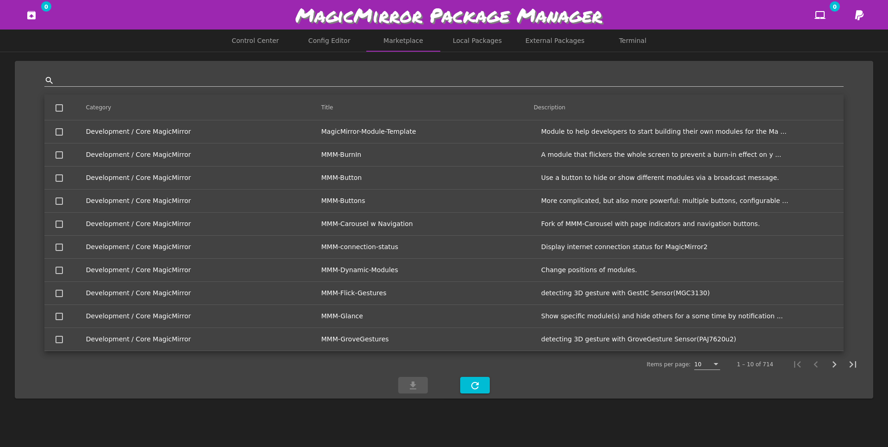
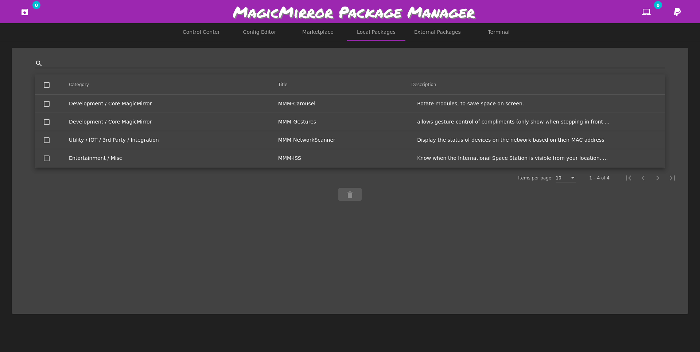
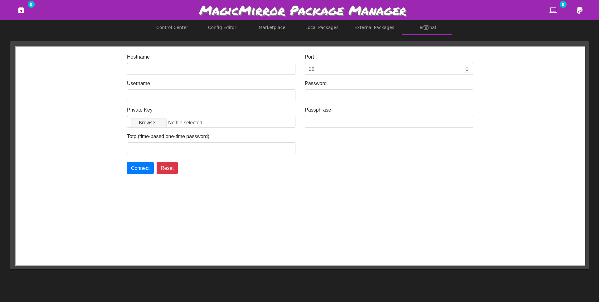

<p align="center">
  <!-- badges start -->
  <a href="https://www.paypal.com/cgi-bin/webscr?cmd=_donations&business=L2ML7F8DTMAT2&currency_code=USD&source=ur" target="_blank">
    
  </a>
  <a href="http://choosealicense.com/licenses/mit" target="_blank">
    
  </a>
  <a href="https://travis-ci.org/github/Bee-Mar/mmpm" target="_blank">
    
  </a>
  <a href="https://hub.docker.com/r/karsten13/mmpm" target="_blank">
    
  </a>
  
  <a href="https://pypi.org/project/mmpm" target="_blank">
    
  </a>
  <!-- badges end -->

  <!-- main title/logo -->
  <a href="https://www.paypal.com/cgi-bin/webscr?cmd=_donations&business=L2ML7F8DTMAT2&currency_code=USD&source=ur" target="_blank">
    
  </a>
</p>

| Author          | Contact                           |
| --------------- | --------------------------------- |
| Brandon Marlowe | bpmarlowe-software@protonmail.com |

`MMPM`, the MagicMirror Package Manager is a self updating command line and graphical interface designed to simplify the installation, removal, and maintenance of MagicMirror packages.

The MagicMirror Package Manager is featured as an alternative installation method on the [MagicMirror Documentation](https://docs.magicmirror.builders/getting-started/installation.html#alternative-installation-methods).

## Features

- Installation, removal, updating, and upgrading of packages
- Search for and show package details
- Adding external packages (think of it like PPAs for Ubuntu)
- Tab-Autocompletion for the CLI
- Quick MagicMirror config editing access
- Installing MagicMirror
- [Hide/Show MagicMirror modules](https://github.com/Bee-Mar/mmpm/wiki/Status,-Hide,-Show-MagicMirror-Modules)
- Start/Stop/Restart MagicMirror (works with `npm`, `pm2`, and `docker-compose`)
- RaspberryPi 3 screen rotation

## Quick Installation Guide

```sh
sudo apt install libffi-dev nginx-full -y
python3 -m pip install --upgrade --no-cache-dir mmpm
mmpm --guided-setup
echo 'export PATH="$PATH:$HOME/.local/bin"' >> ~/.bashrc
```

## Look to the [Wiki](https://github.com/Bee-Mar/mmpm/wiki)

Make sure you've followed all the instructions for [installation](https://github.com/Bee-Mar/mmpm/wiki/MMPM-Installation), configuring [environment variables](https://github.com/Bee-Mar/mmpm/wiki/MMPM-Environment-Variables), and the [hide/show modules feature](https://github.com/Bee-Mar/mmpm/wiki/Status,-Hide,-Show-MagicMirror-Modules) setup.

Note: the Environment Variables setup is **extremely** important.

## Creating Issues

Consult the Wiki before posting any issues, and use one of the provided templates (if possible) when filing an issue.

For any bugs encountered, examine the log files by running `mmpm log`. If creating a GitHub issue is
needed, use one of the issue templates, and please attach the log files, your `config.js`, and
provide what steps can be take to reproduce the bug. You can create a ZIP archive of the MMPM log
files files through the Control Center of the GUI, or by running `mmpm log --zip` through the CLI. If for some reason you cannot access `mmpm log --zip`, you can find the files in `~/.config/mmpm/log` and `/var/log/nginx`. All log files for MMPM in `/var/log/nginx` will be prefixed with either `mmpm-access` or `mmpm-error`.

## GUI Preview

Control Center:



Config Editor:



Active Processes:



MMPM/MagicMirror Marketplace:



MMPM/MagicMirror Locally Installed Packages:



GUI Terminal:



## Potential Problems

This project is entirely dependent on the structure of the [MagicMirror 3rd Party
Modules](https://github.com/MichMich/MagicMirror/wiki/3rd-Party-Modules) page. The HTML is parsed,
and the appropriate text of each module is extracted. If for some reason any of the information is
not displayed correctly, it is most likely due to someone changing the structure of the page.
Ideally, in the future, a database will be constructed, and things will be handeled in a more
formal, predictable way.
