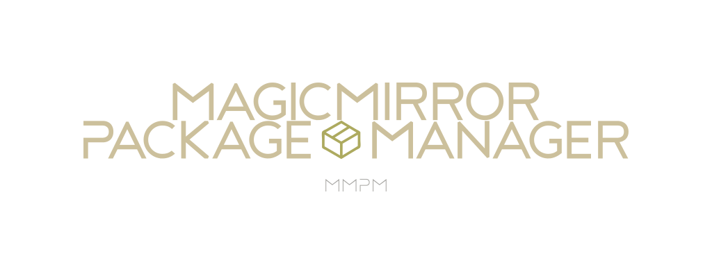

<p align="center">
  <!-- badges start -->
  <a href="https://www.paypal.com/cgi-bin/webscr?cmd=_donations&business=L2ML7F8DTMAT2&currency_code=USD&source=ur" target="_blank">
    
  </a>
  <a href="http://choosealicense.com/licenses/mit" target="_blank">
    
  </a>
  <a href="https://github.com/Bee-Mar/mmpm/actions" target="_blank">
    
  </a>
  <a href="https://hub.docker.com/r/karsten13/mmpm" target="_blank">
    
  </a>
  
  <a href="https://pypi.org/project/mmpm" target="_blank">
    
  </a>
  <!-- badges end -->

  <!-- main title/logo -->
  <a href="https://www.paypal.com/cgi-bin/webscr?cmd=_donations&business=L2ML7F8DTMAT2&currency_code=USD&source=ur" target="_blank">
    
  </a>
</p>

| Author          | Contact                           |
| --------------- | --------------------------------- |
| Brandon Marlowe | bpmarlowe-software@protonmail.com |

`MMPM`, the MagicMirror Package Manager is a self updating command line and graphical interface designed to simplify the installation, removal, and maintenance of MagicMirror packages.

The MagicMirror Package Manager is featured as an alternative installation method on the [MagicMirror Documentation](https://docs.magicmirror.builders/getting-started/installation.html#alternative-installation-methods).


## Quick Installation Guide

MMPM can be installed as a Docker image, or through `pip`.

### [Docker](https://hub.docker.com/r/karsten13/mmpm/)

```sh
docker pull karsten13/mmpm
```

### [pip](https://pypi.org/project/mmpm/)

```sh
python3 -m pip install --upgrade mmpm
```

### Ensure Your PATH is Correct

```sh
echo 'export PATH="$PATH:$HOME/.local/bin"' >> ~/.bashrc && source ~/.bashrc
```

## Features

- Manage packages: install, remove, update, and upgrade.
- Search and view package details.
- Add custom packages (similar to Ubuntu PPAs).
- CLI tab-autocompletion.
- Easy access to MMPM and MagicMirror configuration.
- Manage MagicMirror: install, upgrade, remove.
- Control MagicMirror modules: hide/show ([details](https://github.com/Bee-Mar/mmpm/wiki/Status,-Hide,-Show-MagicMirror-Modules))
- Control MagicMirror state: start, stop, restart (supports npm, pm2, docker-compose).


## Look to the [Wiki](https://github.com/Bee-Mar/mmpm/wiki)

Key Pages:

- [Migrating to MMPM 4.x.x](https://github.com/Bee-Mar/mmpm/wiki/Migrating-to-MMPM%E2%80%904.x.x)
- [Installation & Removal](https://github.com/Bee-Mar/mmpm/wiki/MMPM-Installation-&-Removal)
- [UI Installation & Removal](https://github.com/Bee-Mar/mmpm/wiki/MMPM-UI-Installation-&-Removal)
- [Environment Variables](https://github.com/Bee-Mar/mmpm/wiki/MMPM-Environment-Variables) (**Extremely** important)
- [Hide/Show MagicMirror Modules](https://github.com/Bee-Mar/mmpm/wiki/Status,-Hide,-Show-MagicMirror-Modules)
